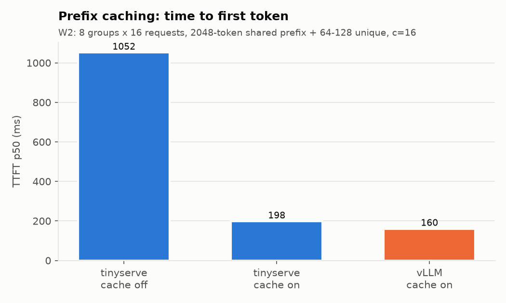
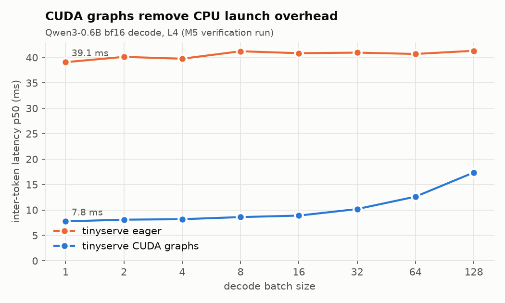
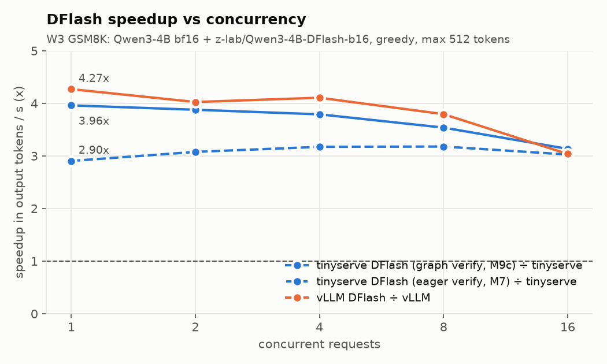
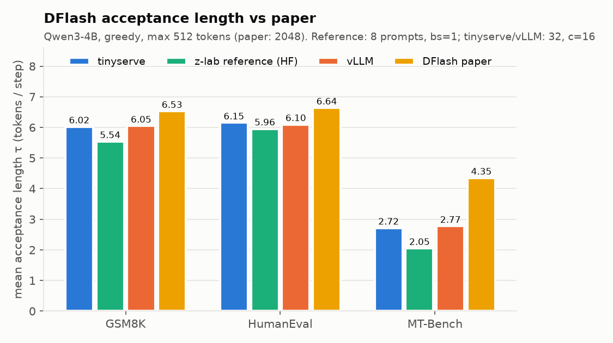
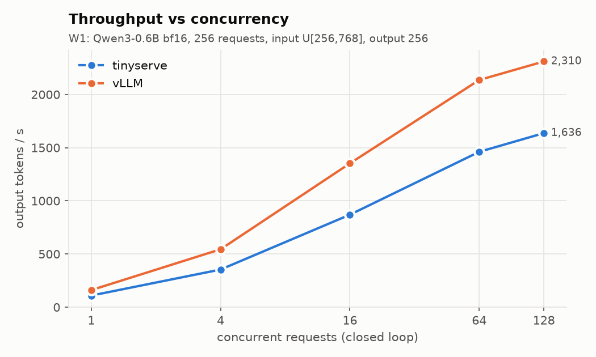
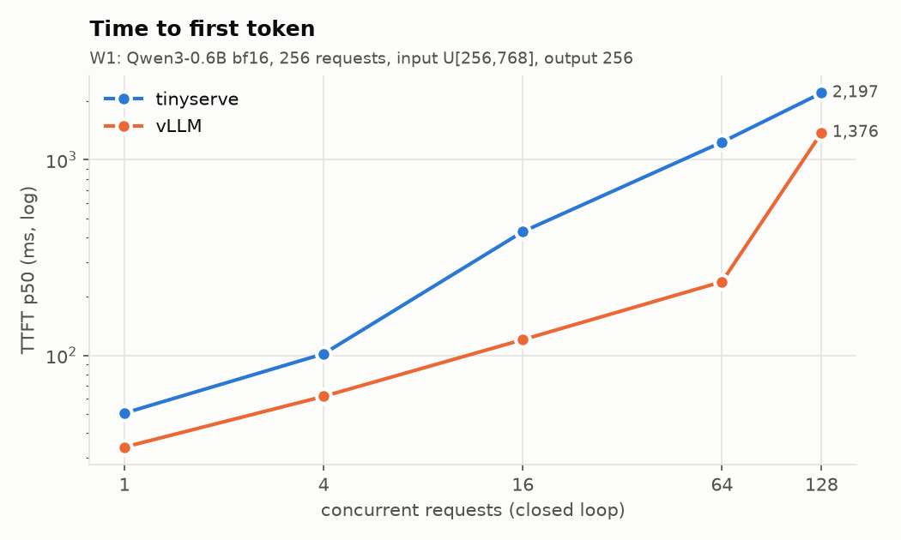
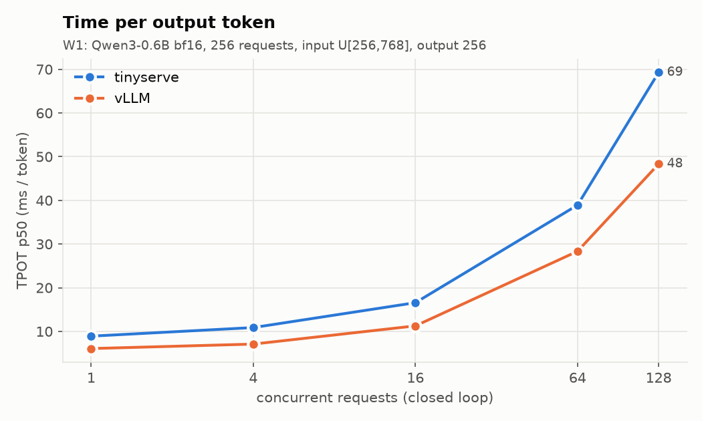

# tinyserve

**A ~2.4k-line LLM inference engine with paged KV, continuous batching, prefix caching, CUDA graphs and 2026 DFlash speculative decoding, benchmarked against vLLM on a $0.80/hr GPU.**

tinyserve serves Qwen3 (0.6B to 4B) through an OpenAI-compatible streaming API. It is written in plain
PyTorch plus flash-attn kernels and one small Triton kernel, and it is tested to be **exactly** correct in
float64 on a laptop CPU before it ever touches a GPU.

> **Headline results** (NVIDIA L4, 2026-10-07; every number links to an artifact in `results/`)
>
> | | |
> |---|---|
> | Throughput vs vLLM 0.30.0, Qwen3-0.6B, 64 concurrent requests | **68% of vLLM** (1,461 vs 2,136 output tok/s) |
> | DFlash speculative decoding, Qwen3-4B, GSM8K, batch 1 | **4.10x** faster than non-spec decode with CUDA graphs (112 vs 27.4 tok/s); vLLM's own DFlash: 4.27x |
> | DFlash acceptance length τ (GSM8K / HumanEval / MT-Bench) | **6.02 / 6.15 / 2.72**; vLLM 6.05 / 6.10 / 2.77; paper 6.53 / 6.64 / 4.35 |
> | Prefix caching, 2048-token shared prefix | time to first token **553.7 → 56.1 ms (9.9x)** |
> | Total GPU spend for the whole project | **$4.44** of Modal credits |

---

## Quickstart

```bash
uv sync                                   # Python 3.12, torch 2.8 (CPU wheels locally)
uv run pytest tests/cpu -m "not slow"     # 79 tests, float64, no GPU needed (~1 min)
uv run pytest tests/cpu -m slow           # real Qwen3-0.6B in float32 vs HF transformers

# GPU work runs on Modal (L4). Every entrypoint runs scripts/cost_guard.py first.
uv run modal run modal_app.py::download_models          # CPU-only, into a Modal Volume
uv run modal run modal_app.py::gpu_tests --suite m7     # DFlash verification suite
uv run modal run modal_app.py::bench --engine tinyserve --suite core
```

Serve and query it like any OpenAI endpoint (transcript from the M6 GPU run is in RESULTS.md):

```bash
python -m tinyserve.server.api --model Qwen/Qwen3-4B --spec-method dflash --spec-draft-model z-lab/Qwen3-4B-DFlash-b16
```

```python
from openai import OpenAI

client = OpenAI(base_url="http://127.0.0.1:8000/v1", api_key="none")
stream = client.chat.completions.create(
    model="Qwen/Qwen3-4B", messages=[{"role": "user", "content": "Name three primary colors."}],
    max_tokens=64, temperature=0, stream=True,
    extra_body={"chat_template_kwargs": {"enable_thinking": False}},
)
print("".join(c.choices[0].delta.content or "" for c in stream if c.choices))
```

Offline API: `from tinyserve import LLM, SamplingParams; LLM("Qwen/Qwen3-0.6B").generate(["Hello"], SamplingParams(max_tokens=32))`.

---

## Architecture

```
 HTTP client ──▶ server/api.py (FastAPI, SSE)  /v1/completions  /v1/chat/completions  /v1/models  /health  /metrics
                   │  tokenize, chat template, incremental detokenizer
                   ▼
                 server/async_engine.py ── one background thread: while work: engine.step()
                   │                        (blocks on an Event when idle; results go back via call_soon_threadsafe)
                   ▼
                 engine.py  LLMEngine.step():
                   1. scheduler.schedule()        -> Batch(PREFILL | DECODE | SPEC)       pure Python
                   2. model_runner.run(batch)     -> new token ids                        torch
                   3. scheduler.postprocess(...)  -> append, stop checks, free blocks     pure Python
                   │
   scheduler.py ───┴── block_manager.py   blocks, ref counts, free list, chained-hash prefix cache (no torch)
   model_runner.py     slot mapping / block tables / cu_seqlens, KV pool, CUDA graphs (decode + spec verify)
     ├── models/qwen3.py    Qwen3 target, returns aux hidden from layers [1, 9, 17, 25, 33] for DFlash
     ├── spec/dflash.py     5-layer DFlash draft with its own KV pool on the SAME block tables
     └── attention/         flash-attn backend (GPU) | pure-PyTorch reference backend (CPU, any block size)
                            | triton_store.py: the one Triton kernel (scatter K/V into cache slots)
```

**Life of a request.** The handler tokenizes the prompt (or applies the chat template with thinking
disabled) and hands it to the engine thread. The scheduler looks up the prompt's full blocks in the prefix
cache, allocates the rest, and runs a PREFILL step over only the uncached tokens. After that the sequence
joins the running set: each step is a DECODE (one token, CUDA-graph replay) or, with DFlash, a SPEC step
(draft 15 tokens, verify 16, keep the agreeing prefix plus one). Every step streams one SSE chunk per
sequence. On EOS / max_tokens the blocks are freed but keep their hashes, so the next request with the same
prefix skips that work.

---

## Why each optimization helps

### Paged KV cache
*Problem:* reserving `max_model_len` contiguous KV slots per request wastes most of the memory and makes
sharing impossible. *Idea (PagedAttention):* the cache is a pool of fixed-size blocks and each sequence
has a block table, like a page table: position `p` lives at `block_table[p // B] * B + p % B`. *In
tinyserve:* `block_manager.py`, plus `model_runner._slots` for the slot mapping. FlashAttention-2's paged
kernels require blocks of 256 tokens, so the GPU path uses 256 (the CPU reference backend accepts any size;
tests use 16). *Effect:* on the L4 at 85% memory, Qwen3-0.6B gets 613 blocks = 157k tokens of KV, enough
for 128 concurrent 1k-token requests.

### Continuous batching with preemption
*Problem:* static batches wait for their slowest member. *Idea (Orca):* reschedule every iteration;
finished sequences leave and waiting ones join at the next step. When the KV pool is full, the newest
sequence is preempted, and later recomputed from prompt + generated tokens (often cheaply, because its
blocks are still in the prefix cache). *In tinyserve:* `scheduler.py`. *Effect:* throughput grows 15x from
1 to 128 concurrent requests (109 → 1,636 tok/s, chart below). In float64, batched, preempted and randomly
arriving requests produce token-identical output to running each alone (`tests/cpu/test_engine_batching.py`).

### Prefix caching (hash chain vs radix tree)
*Problem:* shared system prompts and chat history are recomputed for every request. *Idea:* name each full
block by `xxh64(parent_hash, its tokens)`. The chain makes a hit on block i imply the whole prefix matched,
and lookup is a dict walk until the first miss. This is vLLM's automatic prefix caching. SGLang's
RadixAttention uses a radix tree instead: token-granular matches and natural LRU over branches, at the cost
of more code. tinyserve registers a block only after its KV is computed (and, with DFlash, after the draft's
KV is too), so a hit is always safe. *Effect:* 9.9x faster TTFT in the M4 test; 1,052 → 198 ms TTFT p50 on
the W2 benchmark (vLLM: 160 ms).



### CUDA graphs
*Problem:* a decode step of a small model is hundreds of tiny kernels, and the GPU waits for Python to launch
them. *Idea:* record the decode forward once per batch-size bucket and replay it with one call; pad the
batch to the next bucket, with padded rows pointing at a reserved dummy KV block. *Effect:* Qwen3-0.6B
decode drops from 39.1 to 7.75 ms per token at batch 1 (5.0x) with output identical to eager (32/32).
M9 applies the same trick to the DFlash verify step (1.34x more spec throughput at batch 1).



### DFlash speculative decoding (the headline)
*Problem:* decode is memory-bound. Each step reads all 8 GB of Qwen3-4B's weights to produce one token per
sequence, so batch-1 decode on a 300 GB/s L4 tops out near 37 tok/s (measured: 27.4).

*Idea:* reading the weights once can verify many tokens. A draft guesses 15 tokens; the target scores all 16
positions in one forward; we keep the longest prefix where the draft matched the target's own greedy choice,
plus one bonus token. The output is **identical** to greedy decoding; the draft only changes how many tokens
each step yields. DFlash (Chen, Liang, Liu, 2026) drafts the whole block in **one** non-causal forward of a
5-layer model: the block `[last token, MASK × 15]` is denoised at once, conditioned on hidden states from 5
target layers that are injected into the draft's KV cache. Autoregressive drafters (EAGLE-3) need 15
sequential draft steps for the same block.

*In tinyserve:* `spec/dflash.py` (draft), `spec/proposer.py` (one batched draft forward per step),
`model_runner.run_spec` (verify) and `spec/verify.py` (greedy accept). The draft's KV pool uses the same
block tables as the target, so paging, preemption and prefix caching work unchanged.

*Effect:* 4.10x at batch 1 (offline, graph-captured verify) and 3.96x through the HTTP server, with τ ≈ 6 on
GSM8K and HumanEval, within 1% of vLLM's DFlash and within 2% of the z-lab reference. *Why the speedup
shrinks with concurrency:* at 16 concurrent requests each step verifies 256 tokens, the target forward
starts to become compute-bound, and every rejected token is wasted compute. Both engines converge to ~3.1x
at c=16 (the paper's B200 numbers fall from 4.8x to 2.9x by c=32).




---

## Benchmarks vs vLLM (same L4, same model, same client)

**Method** (PLAN.md §7). Server and load generator run in the same Modal container for both engines, with
byte-identical requests from `bench/client.py` (closed-loop concurrency, streaming). bf16,
`max_model_len=4096`, `gpu_memory_utilization=0.85`, `max_num_seqs=128`, prefix caching on. vLLM 0.30.0 runs
with its defaults (CUDA graphs, torch.compile, chunked prefill). W1/W2 send token-id prompts to
`/v1/completions` with `ignore_eos`; W3 sends chat prompts with `enable_thinking: false` and `temperature: 0`.
Metric definitions follow `vllm/benchmarks/serve.py`. Full tables: [`results/bench/summary.md`](results/bench/summary.md).





| concurrency | 1 | 4 | 16 | 64 | 128 |
|---|---|---|---|---|---|
| tinyserve output tok/s | 109 | 354 | 870 | 1,461 | 1,636 |
| vLLM output tok/s | 161 | 544 | 1,352 | 2,136 | 2,310 |
| tinyserve / vLLM | 68.0% | 65.0% | 64.3% | **68.4%** | 70.8% |

Run-to-run spread (repeat at c=16): tinyserve 870 vs 846 tok/s (2.8%), vLLM 1,352 vs 1,349 (0.2%).
DFlash at c=1: 76.5 vs 76.7 tok/s (eager verify), 104.3 vs 102.0 (graph verify).

**Where the remaining ~32% goes** (one-off `torch.profiler` + step-timing run, `results/verify/profile.log`):
1. **The HTTP layer costs ~21%.** The same workload runs at 1,843 tok/s in the offline engine vs 1,461
   through the server. Server and engine share one Python process: SSE encoding, detokenization and asyncio
   compete with the engine thread for the GIL. vLLM runs its engine core in a separate process.
2. **Prefill is unfused and blocks decode.** A prefill step of up to 8,192 tokens averages 345 ms (~28 TFLOPS,
   23% of the L4's dense peak) and, without chunked prefill, stalls every running decode while it runs.
   This shows up as tinyserve's TTFT at c=64 (1.23 s vs vLLM's 0.24 s).
3. **Decode is GPU-bound, not CPU-bound** (87% of CPU time is spent waiting for the GPU). The gap is kernel
   efficiency: vLLM's torch.compile fuses RMSNorm / RoPE / SiLU-and-mul, while tinyserve runs them as separate
   kernels, and at these context lengths each decode step also reads ~5 GB of KV.

---

## Correctness: how losslessness is tested

* **Exact on CPU in float64.** A torch reference attention backend runs the *whole engine* on a laptop.
  Tiny random Qwen3 models in float64 make greedy decoding free of ties, so the tests demand exact equality:
  logits vs HF transformers < 1e-9; batched == sequential == preempted == random arrival; cache on == cache off;
  spec == non-spec; and, for DFlash, the **per-step acceptance lengths and draft logits equal the vendored z-lab
  reference** (`tests/reference/dflash_ref.py`, MIT). Real Qwen3-0.6B in float32 matches HF `generate` token for token.
* **The tests catch real bugs.** Injecting two bugs from the DFlash debug checklist (off-by-one RoPE positions
  for draft context, missing `k_norm` on context keys) fails the parity tests while losslessness still passes.
  That is expected, since a bad draft only lowers τ.
* **Mock proposers.** An oracle proposer (the target's own continuation) must give τ = 16 exactly; a random one
  τ ≈ 1; a "corrupted oracle" running the real draft forward forces acceptance lengths 1-16 and checks every
  step's draft logits against a from-scratch reference forward.
* **On the GPU, one pre-declared near-tie rule.** bf16 kernels differ in the last bit, so two correct
  implementations can pick different tokens where the top-2 logits are (nearly) equal. A divergence counts only
  if the reference's top-1/top-2 gap there is < 0.5. Any other divergence is reported as a mismatch.

---

## What didn't work / didn't reproduce

Every target below is kept as written in PLAN.md and marked FAIL where missed; the analysis is here.

### bf16 GPU "exact match" targets (M2, M3, M4, M7c): FAIL, and why

The plan expected 87-97% of bf16 GPU outputs to match token for token across kernels or batch shapes.
Measured: M2 3/8 (vs HF), M3 24/64 (batched vs bs=1), M4 14/32 (cache on vs off), M7 32/96 (spec vs non-spec).
The near-tie rule passed on 8/8, 64/64, 32/32 and 93/96.

* The decisive baseline (M2, same run): **HF transformers bf16 sdpa vs HF bf16 eager is also only 3/8 exact**
  (8/8 near-tie). Two attention kernels in the same framework, with the same weights, disagree as often as
  tinyserve disagrees with HF.
* Divergences sit at bf16-quantized gaps: in M3, all 40 were at gaps ≤ 0.25 and **20 at exactly 0.0** (two
  vocabulary entries with the same bf16 logit). A different batch size picks a different cuBLAS GEMM, the
  hidden state changes in its last bit, and the tie flips. In M4 the prompts were random token ids (flat
  distributions); every divergence was a near-tie.
* M2(a) flash vs torch backend: max-abs logit diff 0.75 vs the 0.15 target, but each bf16 backend is about as far from
  float32 (0.89 and 0.77), and flash agrees with float32 on top-1 more often (99.55% vs 99.11%). 0.15 is below
  bf16's noise floor for a 28-layer model: the logit gaps we observe are multiples of 0.125, which is one bf16 ulp
  for values between 16 and 32.
* **M7c has 3 divergences at a gap of exactly 0.5**, the boundary of the rule (< 0.5), so they count as
  mismatches. All 64 divergences have gaps that are multiples of 0.125 (0, 0.125, 0.25 or 0.5), and the
  float64 CPU tests show spec == non-spec exactly, so I believe these are rounding too, but the run did not save
  which prompts diverged, so this is unverified. Next step: re-run those prompts in float32 on the GPU.
* Lesson: exactness belongs in float64/float32 tests; bf16 tests should only assert the near-tie rule.

### DFlash τ on MT-Bench (M7b): 2.72 vs the paper's 4.35, FAIL (target ≥ 3.0)

GSM8K (6.02 vs 6.53) and HumanEval (6.15 vs 6.64) are at 92-93% of the paper and pass. MT-Bench is not a
tinyserve bug: the vendored z-lab reference gets **2.05** on the same prompts, and vLLM's DFlash gets 2.77.
Likely causes, not verified: we use only the first turn of each MT-Bench conversation, cap output at 512
tokens (the paper uses 2048), and may format the prompts differently than the paper's harness.

### Speedup vs the paper (M7d, M8)

The paper reports 5.15x at batch 1 on an H200 with a tuned stack. tinyserve reached 3.12x with an eager spec
path (M7) and 4.10x after graph-capturing the verify step (M9c); vLLM's own DFlash reached 4.27x on the same
L4. The remaining gap to vLLM (112 vs 129 tok/s offline at batch 1) is the draft forward, which is still eager
because its context length varies per step.

### Throughput: 68% of vLLM (target ≥ 60% met; stretch ≥ 85% missed)

See "Where the remaining ~32% goes" above. The three fixes, in expected order of payoff: run the engine core in
its own process; chunked prefill; fused norm/RoPE/activation kernels (or `torch.compile`, a non-goal here).

### Smaller things

* **vLLM 0.30.0 failed to start on `debian_slim`** (M8a smoke): its FlashInfer sampler JIT-compiles a kernel
  with `nvcc`, which the slim image lacks. Fixed with `VLLM_USE_FLASHINFER_SAMPLER=0` (vLLM's PyTorch sampler).
  Attention still uses vLLM's prebuilt flash-attn. vLLM DFlash (`--speculative-config method=dflash`) worked as is.
* **"2 errors" at every W1/W2 point, for both engines.** Not HTTP errors: two of the random-token requests
  generate 256 tokens that are all special tokens, which decode to empty text, so the client never sees a first
  text chunk and cannot measure TTFT. Their tokens are excluded from throughput for both engines (< 1%).
* **Benchmark protocol trims (budget).** W3 used `min(32, 8 × concurrency)` requests per point, and only GSM8K
  was swept over concurrency {1, 2, 4, 8, 16}; HumanEval and MT-Bench ran at c=1 and c=16. The optional W1 point on
  Qwen3-4B and the ShareGPT workload (W4) were skipped.
* **Block size 256** (a flash-attn requirement) makes prefix caching coarse: a 2,100-token shared prefix reuses
  only 2,048 tokens.
* **No HF reference run for the throughput benchmark** (not planned); the bf16 near-tie rule only compares
  engines to themselves or to HF in the verification suites.

---

## Cost

Total Modal spend for the whole project: **$4.44** (`modal billing report`, month to date, including image
builds and CPU downloads), against a planned ~$14 and a hard stop at $25. Every GPU run is a row in
[COSTLOG.md](COSTLOG.md).

What kept it cheap:
- only ephemeral `modal run` (never `deploy`), with explicit timeouts, `max_containers=1` and `scaledown_window=30`;
- weights downloaded once by a CPU-only function into a Volume, and GPU functions run with `HF_HUB_OFFLINE=1`;
- code mounted at runtime, so edits never rebuild images;
- one container per milestone check;
- every bug reproduced on the laptop first, in float64;
- a `cost_guard.py` pre-check that reads the billing API and also sums the local cost log.

Cost per 1M output tokens at the measured W1 c=128 throughput (1,636 tok/s) with the $1.12/h L4 container:
$1.12 / (1,636 × 3,600) × 1e6 ≈ **$0.19 per 1M tokens** for Qwen3-0.6B (vLLM: $0.13).

---

## Differences from nano-vllm

nano-vllm inspired the design: the block manager, the prefill-first scheduler and the flash-attn call pattern.
tinyserve adds:
- (a) DFlash speculative decoding integrated with paged KV, continuous batching, preemption and prefix caching;
- (b) an OpenAI-compatible streaming server with TTFT/ITL/TPOT metrics;
- (c) a head-to-head against vLLM on the same GPU, including vLLM's own DFlash;
- (d) a CPU-runnable reference backend with an exact float64 test suite;
- (e) a cost-disciplined serverless GPU harness;
- (f) this write-up, plus [LEARNING.md](LEARNING.md) for the concepts.

## Future work

Chunked prefill (Sarathi-Serve); a separate engine-core process; overlap of CPU scheduling with GPU work; CUDA
graphs for the DFlash draft; an EAGLE-3 comparison; SuffixDecoding as a second `Proposer`; and the non-goals:
tensor/pipeline parallelism, disaggregated prefill/decode, FP8/INT4 quantization, LoRA, MoE models, lossless
speculative *sampling* at temperature > 0, structured output.

## References and credits

Papers, repos and docs: [RESOURCES.md](RESOURCES.md). Built on
[nano-vllm](https://github.com/GeeeekExplorer/nano-vllm) (design inspiration),
[vLLM](https://github.com/vllm-project/vllm) (baseline, prefix-caching design),
[SGLang](https://github.com/sgl-project/sglang) / [mini-sglang](https://github.com/sgl-project/mini-sglang) (RadixAttention, design reference),
[flash-attention](https://github.com/Dao-AILab/flash-attention) (attention kernels), and
[z-lab/DFlash](https://github.com/z-lab/dflash) (draft model and reference implementation, MIT).
License: MIT.
